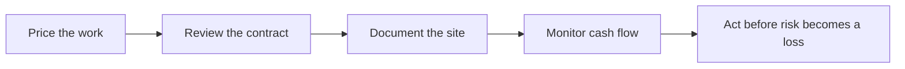
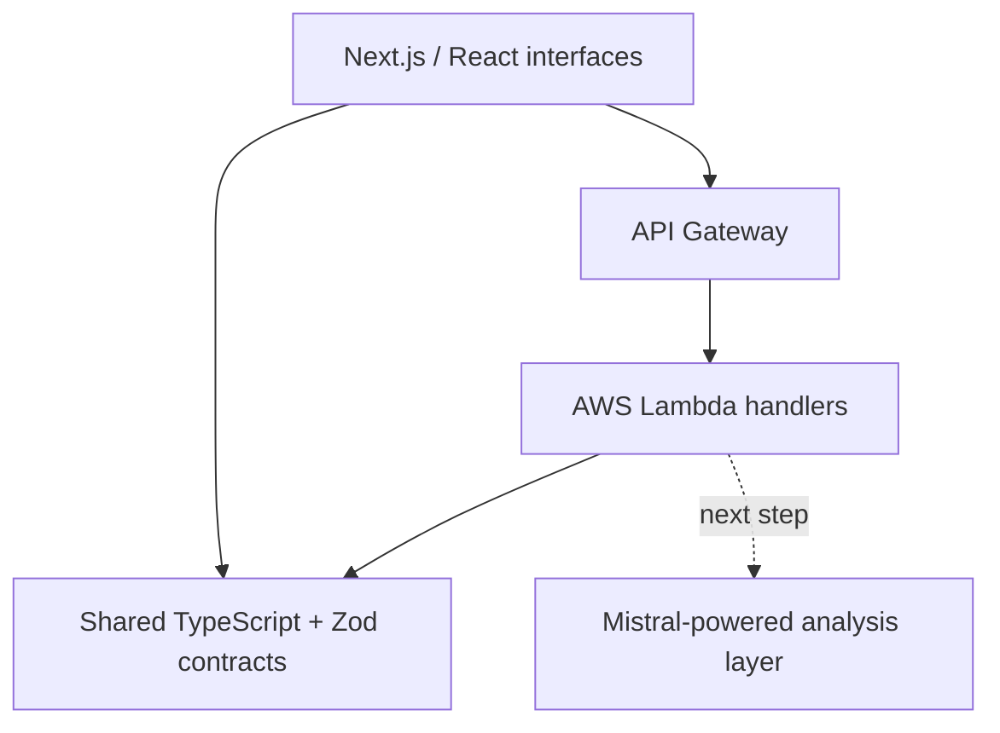

# BuildShield AI

> **Protect the margin. Understand the risk. See the runway.**

[](https://worldwide-hackathon.mistral.ai/)


BuildShield AI is a construction-tech decision-support prototype for independent contractors and small construction businesses. It brings quote protection, contract review, site evidence, and cash-flow visibility into one focused workspace.

The project was created and published as **BuildShield** during the **Mistral AI Worldwide Hackathon**, held from February 28 to March 1, 2026. Its original Hackiterate project page is no longer available following the platform's migration to Iterate; this repository preserves the project's code and development history.

## The problem

Independent construction professionals are highly skilled in the field, but often operate without the financial, legal, and administrative support available to larger firms. A missed cost item, an unbalanced clause, incomplete site evidence, or one late invoice can erase a project's margin.

BuildShield explores a simple idea: give small operators an early-warning system for the decisions that put their business at risk.

## Four layers of protection

| Module | What the prototype demonstrates |
| --- | --- |
| **Quote Intelligence** | Detect cost items from a project description, suggest commonly missed items, model margin and risk, compare scenarios, and export results. |
| **Contract Protection** | Inspect contract text for risky clause patterns, calculate weighted risk scores, explain findings in plain language, and suggest protective amendments. |
| **Cash Flow Radar** | Project inflows and outflows, estimate burn rate and liquidity runway, surface upcoming payments, and compare financial scenarios. |
| **Site Proof** | Upload job-site photos, inspect EXIF timestamps and geolocation, classify image content, and assemble structured evidence summaries. |

Together, these modules form a practical workflow:



## What makes BuildShield different

Most construction software is designed around project administration. BuildShield was designed around **business survival**:

- catch margin leakage before a quote is sent;
- make contractual risk understandable without hiding it behind legal language;
- turn everyday site photos into organized evidence;
- show how long the business can operate under payment delays;
- keep the most important signals visible in one place.

This is not an ERP. It is a prototype for a protective operating layer for small construction businesses.

## Architecture



The repository preserves both the hackathon feature exploration and the production-shaped architecture that followed it:

```text
.
├── apps/web/             # Next.js application shell
├── services/backend/     # Serverless AWS API
├── packages/shared/      # Shared Zod schemas and TypeScript contracts
├── frontend/             # Feature-rich React/Vite hackathon prototype
├── backend/              # Extended backend experiments
└── documentation/        # Architecture notes and development log
```

## API prototype

The typed serverless API currently exposes:

- `GET /health` — service health;
- `POST /quotes/analyze` — quote margin and duration-risk analysis.

Example request:

```bash
curl -X POST http://localhost:3001/quotes/analyze \
  -H 'content-type: application/json' \
  -d '{
    "totalAmount": 50000,
    "durationDays": 14,
    "materialRatio": 0.62
  }'
```

Example response:

```json
{
  "quoteAmount": 50000,
  "estimatedGrossMarginPct": 38,
  "durationRisk": "medium",
  "recommendation": "Risque délai acceptable pour ce niveau de devis."
}
```

## Run the core monorepo

### Requirements

- Node.js 20+
- pnpm 10+

### Installation

```bash
corepack enable
pnpm install
cp apps/web/.env.example apps/web/.env.local
```

Start the backend on port `3001`:

```bash
pnpm --filter @buildshield/backend exec serverless offline --stage local --httpPort 3001
```

Then start the web application:

```bash
pnpm dev:web
```

Open [http://localhost:3000](http://localhost:3000).

To explore the original feature-rich interface:

```bash
cd frontend
npm install
npm run dev
```

## Prototype status

BuildShield is a hackathon proof of concept, not a production service. The repository demonstrates product thinking, feature flows, risk heuristics, financial modeling, shared validation, and a serverless deployment direction.

Current boundaries:

- contract analysis is deterministic and is not legal advice;
- financial outputs use prototype calculations and are not financial advice;
- some interface flows use seeded or local data;
- document extraction and report generation need production hardening;
- the Mistral model integration remains the next major implementation step;
- the historical `frontend/` workspace still contains unresolved strict TypeScript and lint issues.

The core monorepo passes TypeScript validation with:

```bash
pnpm typecheck
```

## Product roadmap

- integrate Mistral OCR for reliable contract and quote ingestion;
- use structured Mistral outputs for explainable risk analysis;
- ground recommendations in construction-specific cost and contract data;
- add persistent projects, authentication, and secure file storage;
- connect live regional material pricing and accounting data;
- generate shareable quote, contract, cash-flow, and site-proof reports;
- add end-to-end tests, CI/CD, monitoring, and production security controls.

## Hackathon provenance

- **Event:** [Mistral AI Worldwide Hackathon 2026](https://worldwide-hackathon.mistral.ai/)
- **Dates:** February 28 – March 1, 2026
- **Format:** worldwide, 48-hour build
- **Published project name:** BuildShield
- **Repository history:** original February 28 development timeline preserved in Git

## Author

Created by [Zacxxx](https://github.com/Zacxxx).

## License

No open-source license has been added to this repository yet.
